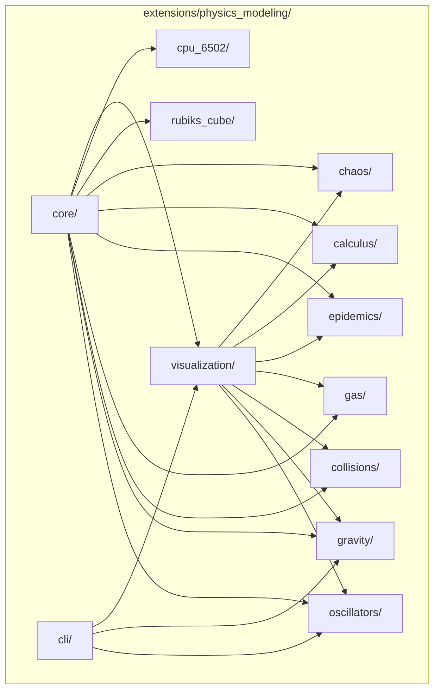

# Design Document: physics-modeling-v2

## Overview

The `physics-modeling` package modernizes the original Modeling Motion simulations into a professional, pip-installable Python library at `extensions/physics_modeling/`. The design centers on a single package with strict internal boundaries: a shared `core/` engine defines all protocols and base classes, and every simulation module depends only on `core/` — never on each other. Physics computation is always separated from visualization as pure functions on NumPy arrays.

The package supports dual execution modes (CLI standalone + Jupyter inline), three visualization backends (matplotlib 2D, Plotly interactive, PyVista 3D), and includes two non-physics applications (Rubik's cube, 6502 simulator) that share only `core/` utilities with the physics modules.

---

## Architecture

### High-Level Architecture Diagram



### Dependency Rules

1. **core/** depends on: `numpy` only (zero internal deps)
2. **Simulation modules** (oscillators, gravity, collisions, gas, epidemics, calculus, chaos) depend on: `core/` only
3. **rubiks_cube/** depends on: `core/` utilities + `kociemba`
4. **cpu_6502/** depends on: `core/` utilities only
5. **visualization/** depends on: `core/` protocols + `matplotlib`/`plotly`/`pyvista`/`ipywidgets`
6. **cli/** depends on: all simulation modules + `visualization/`
7. **No cross-dependencies** between simulation modules

### Package Directory Tree

```
extensions/
├── pyproject.toml
├── README.md
└── physics_modeling/
    ├── __init__.py
    ├── py.typed
    ├── core/
    │   ├── __init__.py
    │   ├── simulation.py      # Base Simulation class
    │   ├── integrators.py     # Euler, RK4, Verlet
    │   ├── protocols.py       # Integrator, Renderer protocols
    │   ├── vectors.py         # NumPy vector utilities
    │   └── runner.py          # SimulationRunner orchestrator
    ├── oscillators/
    │   ├── __init__.py
    │   ├── spring_pendulum.py
    │   ├── double_pendulum.py
    │   └── lissajous.py
    ├── gravity/
    │   ├── __init__.py
    │   ├── bouncing.py        # Single/multi-object gravity+bounce
    │   └── nbody.py           # N-body gravitational
    ├── collisions/
    │   ├── __init__.py
    │   └── elastic.py         # Sphere collision detection+resolution
    ├── gas/
    │   ├── __init__.py
    │   └── hard_sphere.py     # Ideal gas simulation
    ├── epidemics/
    │   ├── __init__.py
    │   ├── sir.py
    │   └── seir.py
    ├── calculus/
    │   ├── __init__.py
    │   ├── logistic.py
    │   └── riemann.py
    ├── chaos/
    │   ├── __init__.py
    │   └── double_pendulum.py  # (re-export from oscillators)
    ├── rubiks_cube/
    │   ├── __init__.py
    │   ├── cube_state.py      # State representation
    │   ├── moves.py           # Move definitions & application
    │   ├── solver.py          # Kociemba integration
    │   ├── scrambler.py       # Random scramble generator
    │   ├── timer.py           # Solve timer
    │   └── validation.py      # State validity checks
    ├── cpu_6502/
    │   ├── __init__.py
    │   ├── cpu.py             # CPU registers, flags, execution
    │   ├── memory.py          # 64KB memory + ROM regions
    │   ├── opcodes.py         # Instruction decoder tables
    │   ├── assembler.py       # Assembly text → machine code
    │   ├── disassembler.py    # Machine code → assembly text
    │   ├── debugger.py        # Step-through debugger
    │   └── lcd.py             # Memory-mapped LCD display
    ├── visualization/
    │   ├── __init__.py
    │   ├── renderer.py        # Renderer protocol
    │   ├── environment.py     # Auto-detection (notebook vs standalone)
    │   ├── matplotlib_backend.py
    │   ├── plotly_backend.py
    │   ├── pyvista_backend.py
    │   └── widgets.py         # ipywidgets + native slider system
    ├── cli/
    │   ├── __init__.py
    │   └── main.py            # CLI entry points
    └── notebooks/
        ├── spring_pendulum_trainer.ipynb
        ├── sir_model_trainer.ipynb
        ├── nbody_trainer.ipynb
        ├── riemann_sums_trainer.ipynb
        └── lissajous_trainer.ipynb
```

### Data Flow


---

## Components and Interfaces

### Core Engine

#### Integrator Protocol

```python
from typing import Protocol, Callable
import numpy as np
from numpy.typing import NDArray

State = NDArray[np.float64]
DerivativeFn = Callable[[State, float], State]


class Integrator(Protocol):
    """Protocol for numerical integrators."""

    def step(
        self,
        state: State,
        t: float,
        dt: float,
        derivatives: DerivativeFn,
    ) -> State:
        """Advance state by one time step dt."""
        ...
```

#### Integrator Implementations

```python
class EulerIntegrator:
    """First-order explicit Euler: x(t+dt) = x(t) + f(x,t)*dt"""

    def step(self, state: State, t: float, dt: float,
             derivatives: DerivativeFn) -> State:
        return state + derivatives(state, t) * dt


class RK4Integrator:
    """Fourth-order Runge-Kutta with standard weights (1/6, 1/3, 1/3, 1/6)."""

    def step(self, state: State, t: float, dt: float,
             derivatives: DerivativeFn) -> State:
        k1 = derivatives(state, t)
        k2 = derivatives(state + 0.5 * dt * k1, t + 0.5 * dt)
        k3 = derivatives(state + 0.5 * dt * k2, t + 0.5 * dt)
        k4 = derivatives(state + dt * k3, t + dt)
        return state + (dt / 6.0) * (k1 + 2*k2 + 2*k3 + k4)


class VerletIntegrator:
    """Velocity Verlet symplectic integrator for position-velocity systems.

    Expects state as [positions..., velocities...] with equal halves.
    """

    def step(self, state: State, t: float, dt: float,
             derivatives: DerivativeFn) -> State:
        n = len(state) // 2
        pos, vel = state[:n], state[n:]
        acc = derivatives(state, t)[n:]  # acceleration from current state
        new_pos = pos + vel * dt + 0.5 * acc * dt**2
        new_state_mid = np.concatenate([new_pos, vel])
        new_acc = derivatives(new_state_mid, t + dt)[n:]
        new_vel = vel + 0.5 * (acc + new_acc) * dt
        return np.concatenate([new_pos, new_vel])
```

#### Base Simulation Class

```python
from abc import ABC, abstractmethod
from dataclasses import dataclass
import numpy as np

@dataclass
class SimulationConfig:
    """Base configuration shared by all simulations."""
    dt: float = 0.01
    integrator: str = "rk4"  # "euler", "rk4", "verlet"

class Simulation(ABC):
    """Abstract base for all physics simulations."""

    def __init__(self, config: SimulationConfig) -> None:
        self._t: float = 0.0
        self._state: State = self.initial_state()
        self._integrator = _make_integrator(config.integrator)
        self._dt = config.dt

    @abstractmethod
    def initial_state(self) -> State:
        """Return the initial state vector."""
        ...

    @abstractmethod
    def derivatives(self, state: State, t: float) -> State:
        """Compute time derivatives of state."""
        ...

    @property
    def state(self) -> State:
        """Current simulation state."""
        return self._state

    @property
    def t(self) -> float:
        """Current simulation time."""
        return self._t

    def step(self, dt: float | None = None) -> State:
        """Advance simulation by one time step."""
        dt = dt or self._dt
        self._state = self._integrator.step(
            self._state, self._t, dt, self.derivatives
        )
        self._t += dt
        return self._state

    def run(self, t_end: float, dt: float | None = None) -> NDArray:
        """Run simulation from t=0 to t_end, return full time-series."""
        dt = dt or self._dt
        steps = int(t_end / dt)
        history = np.zeros((steps + 1, len(self._state)))
        history[0] = self._state
        for i in range(1, steps + 1):
            self.step(dt)
            history[i] = self._state
        return history
```

#### SimulationRunner

```python
class SimulationRunner:
    """Orchestrates simulation stepping and rendering."""

    def __init__(
        self,
        simulation: Simulation,
        renderer: "Renderer",
        dt: float = 0.01,
        fps: int = 60,
    ) -> None:
        self._sim = simulation
        self._renderer = renderer
        self._dt = dt
        self._fps = fps
        self._running = False

    def start(self) -> None:
        """Begin the step-render loop."""
        self._running = True
        while self._running:
            self._sim.step(self._dt)
            self._renderer.draw(self._sim.state, self._sim.t)

    def stop(self) -> None:
        self._running = False
```

### Visualization Architecture

#### Renderer Protocol

```python
from typing import Protocol, Any

class Renderer(Protocol):
    """Common interface for all visualization backends."""

    def setup(self, config: dict[str, Any]) -> None:
        """Initialize the display (window, canvas, figure)."""
        ...

    def draw(self, state: State, t: float) -> None:
        """Render the current simulation state."""
        ...

    def add_slider(
        self,
        name: str,
        min_val: float,
        max_val: float,
        initial: float,
        callback: Callable[[float], None],
    ) -> None:
        """Add an interactive parameter slider."""
        ...

    def close(self) -> None:
        """Clean up display resources."""
        ...
```

#### Backend Implementations

| Backend | Use Case | Library | Environment |
|---------|----------|---------|-------------|
| `MatplotlibRenderer` | 2D time series, histograms, Riemann rectangles | matplotlib | Both |
| `PlotlyRenderer` | Interactive 2D/3D in notebooks | plotly | Notebook preferred |
| `PyVistaRenderer` | Standalone 3D (orbits, pendulums, gas) | pyvista | Standalone preferred |
| `WidgetRenderer` | Parameter controls overlay | ipywidgets | Notebook only |

#### Environment Auto-Detection

```python
def detect_environment() -> Literal["notebook", "standalone", "headless"]:
    """Detect execution environment for renderer selection."""
    try:
        from IPython import get_ipython
        shell = get_ipython()
        if shell is not None and "IPKernelApp" in shell.config:
            return "notebook"
    except (ImportError, AttributeError):
        pass
    if os.environ.get("DISPLAY") or sys.platform == "win32":
        return "standalone"
    return "headless"
```

### Per-Module Simulation Designs

#### Spring Pendulum (oscillators/spring_pendulum.py)

**State vector:** `[x, y, z, vx, vy, vz]` — position and velocity of the bob in 3D.

**Parameters:** `k` (spring constant), `damping`, `mass`, `rest_length`, `g`, `air_resistance`

**Derivatives:**
- Compute extension `S = |pos| - rest_length`
- `F_spring = -k * S * pos_hat`
- `F_damp = -damping * dot(vel, pos_hat) * pos_hat`
- `F_air = -air_resistance * vel`
- `F_gravity = [0, -mass*g, 0]`
- `a = (F_spring + F_damp + F_air + F_gravity) / mass`
- Return `[vx, vy, vz, ax, ay, az]`

#### Gravity and Bouncing (gravity/bouncing.py)

**State vector:** Per object: `[x, y, z, vx, vy, vz]`. Multi-object: stacked array `(N, 6)`.

**Parameters:** `g`, `coefficient_of_restitution`, `boundary_y`, `extent`

**Logic:**
- Standard gravity integration for free-flight
- On floor collision: `vy = -vy * restitution`, clamp position above floor
- Remove objects exiting boundary extent

#### N-Body (gravity/nbody.py)

**State vector:** `[x1,y1,z1,...,xN,yN,zN, vx1,vy1,vz1,...,vxN,vyN,vzN]` — flattened positions then velocities for N bodies.

**Parameters:** `G` (gravitational constant), `softening` (epsilon), `masses: NDArray`

**Derivatives:**
- For each pair (i,j): `F_ij = G * mi * mj * (rj - ri) / (|rj-ri|^2 + eps^2)^(3/2)`
- Sum forces per body, divide by mass for acceleration

#### Elastic Collisions (collisions/elastic.py)

**State vector:** `(N, 6)` for N spheres with `[x, y, z, vx, vy, vz]`.

**Parameters:** `radii: NDArray`, `masses: NDArray`

**Collision detection:** Check `|center_i - center_j| < radius_i + radius_j` for all pairs.

**Resolution:** Standard elastic collision formula:
```
v1' = v1 - (2*m2/(m1+m2)) * dot(v1-v2, x1-x2)/|x1-x2|^2 * (x1-x2)
v2' = v2 - (2*m1/(m1+m2)) * dot(v2-v1, x2-x1)/|x2-x1|^2 * (x2-x1)
```

#### Hard Sphere Gas (gas/hard_sphere.py)

**State vector:** `(N, 6)` — positions and velocities for N particles.

**Parameters:** `container_size: tuple[float,float,float]`, `particle_radius`, `N`

**Logic:**
- Advance particles ballistically between collisions
- Event-driven collision detection (next collision time for all pairs + walls)
- Elastic resolution for particle-particle and particle-wall
- Measure temperature from `<KE> = (3/2) * k_B * T`, pressure from wall impulse/area/time

#### SIR / SEIR (epidemics/sir.py, epidemics/seir.py)

**SIR State vector:** `[S, I, R]`

**SIR Derivatives:** `[-β*S*I/N, β*S*I/N - γ*I, γ*I]` where `N = S + I + R`

**SEIR State vector:** `[S, E, I, R]`

**SEIR Derivatives:** `[-β*S*I/N, β*S*I/N - σ*E, σ*E - γ*I, γ*I]`

**Invariant:** `sum(state) == N` preserved at all times.

#### Logistic Equation (calculus/logistic.py)

**State vector:** `[y]`

**Derivatives:** `[r * y * (1 - y/K)]`

**Parameters:** `r` (growth rate), `K` (carrying capacity), `y0`

**Analytical solution:** `y(t) = K / (1 + ((K-y0)/y0) * exp(-r*t))`

#### Lissajous Figures (oscillators/lissajous.py)

Not a differential equation simulation — parametric curve generation.

```python
def generate_lissajous(
    a: float, b: float, c: float,
    A: float, B: float, C: float,
    delta: float, n_points: int
) -> NDArray:
    """Generate 3D Lissajous curve points.

    Returns shape (n_points, 3) array.
    """
    t = np.linspace(0, 2 * np.pi * lcm_period(a, b, c), n_points)
    x = A * np.cos(a * t + delta)
    y = B * np.sin(b * t)
    z = C * np.sin(c * t)
    return np.column_stack([x, y, z])
```

#### Riemann Sums (calculus/riemann.py)

Pure computation — no ODE integration.

```python
@dataclass
class RiemannResult:
    sum_value: float
    rectangles: NDArray  # shape (n, 4): [x_left, width, height, x_mid]
    reference_integral: float
    relative_error: float

def riemann_sum(
    f: Callable[[float], float],
    a: float, b: float, n: int,
    method: Literal["left", "right", "midpoint", "trapezoid"],
) -> RiemannResult:
    ...
```

#### Double Pendulum (oscillators/double_pendulum.py)

**State vector:** `[θ1, θ2, ω1, ω2]` — angles and angular velocities.

**Derivatives:** Lagrangian equations of motion:
```
ω1' = [-g(2m1+m2)sinθ1 - m2*g*sin(θ1-2θ2) - 2sin(θ1-θ2)*m2*(ω2²L2 + ω1²L1cos(θ1-θ2))]
      / [L1(2m1+m2-m2cos(2θ1-2θ2))]

ω2' = [2sin(θ1-θ2)(ω1²L1(m1+m2) + g(m1+m2)cosθ1 + ω2²L2*m2*cos(θ1-θ2))]
      / [L2(2m1+m2-m2cos(2θ1-2θ2))]
```

**Parameters:** `L1, L2, m1, m2, g`

### Rubik's Cube Design

#### State Representation

The cube state uses an array-based facelet model — a `(6, 3, 3)` integer array where each element represents the color of one facelet. This is simpler to implement and reason about than tracking individual cubie positions, while being sufficient for Kociemba solver integration.

```python
@dataclass(frozen=True)
class CubeState:
    """Immutable Rubik's cube state.

    facelets: shape (6, 3, 3) array of face color indices (0-5).
    Face ordering: U=0, D=1, L=2, R=3, F=4, B=5
    """
    facelets: NDArray[np.int8]  # (6, 3, 3)

    @classmethod
    def solved(cls) -> "CubeState":
        """Create a solved cube."""
        facelets = np.zeros((6, 3, 3), dtype=np.int8)
        for i in range(6):
            facelets[i] = i
        return cls(facelets=facelets)

    def is_solved(self) -> bool:
        """Check if cube is in solved state."""
        return all(
            np.all(self.facelets[i] == i) for i in range(6)
        )

    def to_kociemba_string(self) -> str:
        """Convert to Kociemba solver input format."""
        ...
```

#### Move System

```python
class Move(Enum):
    U = "U"; U_PRIME = "U'"; U2 = "U2"
    D = "D"; D_PRIME = "D'"; D2 = "D2"
    L = "L"; L_PRIME = "L'"; L2 = "L2"
    R = "R"; R_PRIME = "R'"; R2 = "R2"
    F = "F"; F_PRIME = "F'"; F2 = "F2"
    B = "B"; B_PRIME = "B'"; B2 = "B2"

def apply_move(state: CubeState, move: Move) -> CubeState:
    """Apply a single move to produce a new CubeState (immutable)."""
    ...

def apply_sequence(state: CubeState, moves: list[Move]) -> CubeState:
    """Apply a sequence of moves."""
    ...

def inverse_move(move: Move) -> Move:
    """Return the inverse of a move (U → U', U' → U, U2 → U2)."""
    ...

def inverse_sequence(moves: list[Move]) -> list[Move]:
    """Reverse and invert a move sequence."""
    return [inverse_move(m) for m in reversed(moves)]
```

#### Solver Integration

```python
def solve(state: CubeState) -> list[Move]:
    """Find near-optimal solution using Kociemba algorithm (max 20 moves)."""
    import kociemba
    solution_str = kociemba.solve(state.to_kociemba_string())
    return parse_move_string(solution_str)
```

#### Scramble Generator

```python
def generate_scramble(length: int = 20) -> list[Move]:
    """Generate random scramble with no consecutive same-face moves."""
    ...
```

#### Validation

```python
def is_valid_state(state: CubeState) -> bool:
    """Check solvability: correct piece count, valid orientations, valid parity."""
    ...
```

### 6502 CPU Simulator Design

#### CPU Architecture

```python
@dataclass
class CPUState:
    """Complete 6502 CPU state."""
    a: int = 0       # Accumulator (8-bit)
    x: int = 0       # Index register X (8-bit)
    y: int = 0       # Index register Y (8-bit)
    sp: int = 0xFD   # Stack pointer (8-bit, page $0100-$01FF)
    pc: int = 0      # Program counter (16-bit)
    # Status register flags
    n: bool = False  # Negative
    v: bool = False  # Overflow
    b: bool = False  # Break
    d: bool = False  # Decimal mode
    i: bool = True   # Interrupt disable
    z: bool = True   # Zero
    c: bool = False  # Carry

    @property
    def status(self) -> int:
        """Pack flags into P register byte."""
        ...

    @status.setter
    def status(self, value: int) -> None:
        """Unpack P register byte into flags."""
        ...
```

#### Memory System

```python
class Memory:
    """64KB addressable memory with ROM regions and memory-mapped I/O."""

    def __init__(self) -> None:
        self._ram = bytearray(65536)
        self._rom_regions: list[tuple[int, int]] = []  # (start, end)
        self._io_handlers: dict[int, IOHandler] = {}

    def read(self, address: int) -> int:
        """Read byte from address (0x0000-0xFFFF)."""
        ...

    def write(self, address: int, value: int) -> None:
        """Write byte. Ignores writes to ROM. Triggers I/O handlers."""
        ...

    def load_rom(self, data: bytes, start_address: int) -> None:
        """Load bytes into memory and mark region as ROM."""
        ...

    def register_io(self, address: int, handler: "IOHandler") -> None:
        """Register memory-mapped I/O handler at address."""
        ...
```

#### Instruction Decoder

Design decision: Table-driven decoder. A dictionary maps opcode bytes to `(mnemonic, addressing_mode, cycles)` tuples. This avoids a massive if/elif chain and makes testing straightforward.

```python
@dataclass
class Instruction:
    opcode: int
    mnemonic: str
    addressing_mode: AddressingMode
    operand: int  # 0, 1, or 2 byte operand
    cycles: int

class AddressingMode(Enum):
    IMMEDIATE = "imm"
    ZERO_PAGE = "zpg"
    ZERO_PAGE_X = "zpx"
    ZERO_PAGE_Y = "zpy"
    ABSOLUTE = "abs"
    ABSOLUTE_X = "abx"
    ABSOLUTE_Y = "aby"
    INDIRECT = "ind"
    INDEXED_INDIRECT = "izx"  # (indirect,X)
    INDIRECT_INDEXED = "izy"  # (indirect),Y
    IMPLIED = "imp"
    ACCUMULATOR = "acc"
    RELATIVE = "rel"

def decode(memory: Memory, pc: int) -> Instruction:
    """Decode instruction at PC, return Instruction with operand."""
    ...
```

#### Assembler Architecture

```python
@dataclass
class AssemblyLine:
    label: str | None
    mnemonic: str
    operand: str | None
    comment: str | None

def assemble(source: str) -> bytes:
    """Two-pass assembler: resolve labels then emit bytes.

    Pass 1: Scan for labels, build symbol table.
    Pass 2: Emit opcodes + operands, resolve label references.
    """
    ...

def disassemble(data: bytes, start_address: int = 0) -> str:
    """Convert machine code back to assembly text."""
    ...
```

#### Memory-Mapped LCD

```python
class LCDDisplay:
    """16x2 character LCD mapped to a memory address range."""

    def __init__(self, base_address: int = 0x6000, cols: int = 16, rows: int = 2):
        self.buffer: list[list[str]] = [[' ']*cols for _ in range(rows)]
        self.cursor_row = 0
        self.cursor_col = 0

    def write(self, address: int, value: int) -> None:
        """Handle write to LCD address range."""
        # address offsets: 0=data, 1=command
        ...

    def get_display(self) -> list[str]:
        """Return current display content as list of row strings."""
        ...
```

#### Debugger Interface

```python
class Debugger:
    """Step-through debugger for the 6502."""

    def __init__(self, cpu: "CPU6502") -> None: ...
    def step(self) -> Instruction: ...
    def get_registers(self) -> CPUState: ...
    def get_disassembly(self, address: int, count: int = 10) -> list[str]: ...
    def get_memory_view(self, start: int, length: int = 256) -> bytes: ...
    def set_breakpoint(self, address: int) -> None: ...
    def run_until_break(self) -> None: ...
```

---

## Data Models

### Configuration Dataclasses

```python
@dataclass
class SpringPendulumConfig(SimulationConfig):
    k: float = 10.0
    damping: float = 0.05
    mass: float = 1.0
    rest_length: float = 2.0
    g: float = 9.8
    air_resistance: float = 0.01
    initial_angle: float = 0.5  # radians
    initial_velocity: tuple[float, float, float] = (0, 0, 0)


@dataclass
class GravityConfig(SimulationConfig):
    g: float = 9.8
    restitution: float = 0.8
    boundary_y: float = 0.0
    extent: float = 50.0

@dataclass
class NBodyConfig(SimulationConfig):
    G: float = 6.674e-11
    softening: float = 1e-4
    integrator: str = "verlet"

@dataclass
class CollisionConfig(SimulationConfig):
    dimensions: Literal[2, 3] = 3

@dataclass
class GasConfig(SimulationConfig):
    n_particles: int = 200
    container_size: tuple[float, float, float] = (10.0, 10.0, 10.0)
    particle_radius: float = 0.1

@dataclass
class SIRConfig(SimulationConfig):
    S0: float = 45400.0
    I0: float = 2100.0
    R0: float = 2500.0
    beta: float = 0.0001   # transmission rate (β*N normalized)
    gamma: float = 1/14    # recovery rate

@dataclass
class SEIRConfig(SIRConfig):
    E0: float = 0.0
    sigma: float = 1/5     # incubation rate (1/avg incubation days)

@dataclass
class LogisticConfig(SimulationConfig):
    y0: float = 100.0
    r: float = 0.1
    K: float = 1000.0
    t_end: float = 75.0

@dataclass
class LissajousConfig:
    a: float = 1.0; b: float = 1.0; c: float = 1.0
    A: float = 1.0; B: float = 1.0; C: float = 1.0
    delta: float = 0.0
    n_points: int = 1000

@dataclass
class RiemannConfig:
    function: Callable[[float], float] = lambda x: x**2
    a: float = 0.0
    b: float = 1.0
    n: int = 100
    method: Literal["left", "right", "midpoint", "trapezoid"] = "midpoint"

@dataclass
class DoublePendulumConfig(SimulationConfig):
    L1: float = 1.0; L2: float = 1.0
    m1: float = 1.0; m2: float = 1.0
    g: float = 9.8
    theta1_0: float = 2.0; theta2_0: float = 2.0
    omega1_0: float = 0.0; omega2_0: float = 0.0

@dataclass
class CPU6502Config:
    rom_start: int = 0x8000
    lcd_base: int = 0x6000
    lcd_cols: int = 16
    lcd_rows: int = 2
```

### State Vector Summary

| Simulation | State Shape | Components |
|-----------|-------------|------------|
| Spring Pendulum | `(6,)` | x, y, z, vx, vy, vz |
| Gravity (N objs) | `(N, 6)` | per-object position + velocity |
| N-Body (N bodies) | `(6N,)` | x,y,z for all then vx,vy,vz for all |
| Collisions | `(N, 6)` | per-sphere position + velocity |
| Gas | `(N, 6)` | per-particle position + velocity |
| SIR | `(3,)` | S, I, R |
| SEIR | `(4,)` | S, E, I, R |
| Logistic | `(1,)` | y |
| Lissajous | `(n_points, 3)` | precomputed curve, not ODE |
| Double Pendulum | `(4,)` | θ1, θ2, ω1, ω2 |


### Serialization

Simulation state snapshots use NumPy's `.npz` format for numerical data and JSON for configuration:

```python
def save_state(sim: Simulation, path: Path) -> None:
    """Save simulation state + config to disk."""
    np.savez(path.with_suffix(".npz"), state=sim.state, t=sim.t)
    with open(path.with_suffix(".json"), "w") as f:
        json.dump(dataclasses.asdict(sim.config), f)

def load_state(sim_class: type[Simulation], path: Path) -> Simulation:
    """Restore simulation from saved state."""
    ...
```

---

## Correctness Properties

*A property is a characteristic or behavior that should hold true across all valid executions of a system — essentially, a formal statement about what the system should do. Properties serve as the bridge between human-readable specifications and machine-verifiable correctness guarantees.*

### Property 1: Integrator Dimensionality and Formula Correctness

*For any* state vector of arbitrary dimension and any derivative function, all integrators SHALL produce an output array of the same shape as the input, and the Euler integrator output SHALL equal `state + derivatives(state, t) * dt` exactly.

**Validates: Requirements 2.1, 2.6**

### Property 2: Energy Conservation in Conservative Systems

*For any* valid initial conditions of a conservative system (zero damping, zero external energy input) — including simple harmonic oscillator, spring pendulum, N-body Kepler orbit, and double pendulum — the Verlet integrator SHALL preserve total energy within the specified tolerance (0.1% for SHO over 10,000 steps, 0.5% for spring pendulum over 1,000 steps, 1% for Kepler over 100 orbits, 0.5% for double pendulum over 10,000 steps), and RK4 SHALL preserve energy within the same bounds.

**Validates: Requirements 2.4, 3.3, 5.3, 13.3**

### Property 3: Integrator Accuracy Against Analytical Solutions

*For any* initial conditions `x=A, v=0` applied to the simple harmonic oscillator `x'' = -x`, all integrators with dt=0.01 SHALL produce position values within 1% of `A*cos(t)` for t in [0, 10]. Additionally, *for any* valid logistic equation parameters (y0, r, K), RK4 with 1000 steps over [0, 75] SHALL produce values within 0.1% of the analytical solution `K / (1 + ((K-y0)/y0)*exp(-r*t))`.

**Validates: Requirements 2.8, 10.3**

### Property 4: Elastic Collision Conservation

*For any* two or more spherical objects with arbitrary masses, positions, velocities, and radii in 2D or 3D, when an elastic collision is detected and resolved, the total momentum (vector sum of m*v for all objects) SHALL be preserved within 0.01%, and the total kinetic energy (sum of 0.5*m*|v|²) SHALL be preserved within 0.01%.

**Validates: Requirements 6.2, 6.3, 6.4, 6.5, 6.6**

### Property 5: Epidemiological Population Conservation

*For any* valid initial compartment populations and transmission/recovery parameters, the SIR model SHALL preserve `S + I + R = N` and the SEIR model SHALL preserve `S + E + I + R = N` with deviation less than 1e-10 at every time step throughout the simulation.

**Validates: Requirements 8.3, 9.3**

### Property 6: SIR Monotone Decrease When R₀ < 1

*For any* valid initial populations (S₀, I₀, R₀) and parameters β, γ where β/γ < 1 (basic reproduction number less than 1), the infected population I(t) SHALL be monotonically non-increasing throughout the simulation.

**Validates: Requirements 8.5**

### Property 7: Lissajous Curve Closure for Rational Frequencies

*For any* rational frequency ratios a:b (where a and b are positive integers) and any amplitudes and phase offset, the generated Lissajous curve SHALL produce a closed curve where the endpoint coincides with the start point within 1e-6 when t spans one full period (2π * LCM(1/a, 1/b)).

**Validates: Requirements 11.3**

### Property 8: Riemann Sum Monotone Convergence

*For any* monotone function f on interval [a, b] with a < b, doubling the number of subdivisions n SHALL produce a Riemann sum that is strictly closer to the analytical integral than the sum with n subdivisions: `|riemann(f, a, b, 2n) - ∫f| < |riemann(f, a, b, n) - ∫f|`.

**Validates: Requirements 12.3**

### Property 9: Rubik's Cube Move-Inverse Round-Trip

*For any* valid cube state and *for any* sequence of moves (of arbitrary length), applying the sequence followed by the inverse sequence in reverse order SHALL produce the original cube state.

**Validates: Requirements 14.3**

### Property 10: Rubik's Cube State Validity

*For any* valid cube state and *for any* single move or sequence of moves, the resulting state SHALL pass the solvability validation check (correct piece count, valid orientations, valid permutation parity). Conversely, *for any* state produced by randomly corrupting a facelet value, the validation check SHALL return false.

**Validates: Requirements 14.2, 14.4**

### Property 11: Rubik's Cube Scramble Constraints

*For any* generated scramble, the length SHALL be between 20 and 25 moves inclusive, and no two consecutive moves in the scramble SHALL operate on the same face.

**Validates: Requirements 14.9**

### Property 12: 6502 Assemble-Execute Round-Trip

*For any* documented opcode with valid random operands, assembling the instruction to bytes, loading those bytes into memory, and executing SHALL produce the register and memory effects documented for that opcode. Additionally, *for any* valid assembly instruction, `disassemble(assemble(instruction))` SHALL produce an equivalent instruction string.

**Validates: Requirements 15.7, 15.8**

### Property 13: 6502 Memory ROM Protection

*For any* address marked as ROM and *for any* byte value written to that address, a subsequent read from that address SHALL return the original ROM contents (the write is silently ignored).

**Validates: Requirements 15.3**

### Property 14: 6502 BCD Arithmetic Correctness

*For any* pair of valid BCD operands (0x00-0x99) with the D flag set, ADC SHALL produce the correct decimal sum with appropriate carry flag, and SBC SHALL produce the correct decimal difference with appropriate borrow.

**Validates: Requirements 15.11**

### Property 15: Gravity Bounce Energy Preservation

*For any* object with arbitrary velocity approaching a boundary, when the coefficient of restitution is 1.0, the kinetic energy before the bounce SHALL equal the kinetic energy after the bounce within 1%.

**Validates: Requirements 4.3**

### Property 16: Boundary Object Removal

*For any* object whose position exceeds the simulation extent in any horizontal direction, the simulation SHALL mark that object for removal (it SHALL NOT appear in the active objects list on the next step).

**Validates: Requirements 4.5**

### Property 17: Gas Kinetic Energy Conservation

*For any* initial configuration of N hard sphere particles in a bounded container, the total kinetic energy of the system SHALL remain within 0.1% of its initial value throughout the simulation (all collisions are elastic).

**Validates: Requirements 7.3**

### Property 18: Lissajous Parametric Formula Correctness

*For any* parameters (a, b, c, A, B, C, δ) and *for any* time t, the generated curve point SHALL satisfy `x = A*cos(a*t + δ)`, `y = B*sin(b*t)`, `z = C*sin(c*t)` exactly (within floating-point epsilon).

**Validates: Requirements 11.1**

### Property 19: 6502 Stack Pointer Wrap-Around

*For any* stack operation (push) when the stack pointer is at $00, the stack pointer SHALL wrap to $FF after the push, and the data SHALL be written to address $0100 + original_SP. Similarly, *for any* pull when SP is at $FF, it SHALL wrap to $00.

**Validates: Requirements 15.6**

### Property 20: N-Body Softening Prevents Divergence

*For any* two bodies at arbitrarily small separation (including zero distance), the computed gravitational force SHALL remain finite (bounded by `G*m1*m2/eps²` where eps is the softening parameter).

**Validates: Requirements 5.2**

### Property 21: Simulation Run Output Shape

*For any* simulation with state dimension D, calling `run(t_end, dt)` SHALL return an array of shape `(int(t_end/dt) + 1, D)` where the first row equals the initial state.

**Validates: Requirements 2.7**

---

## Error Handling

### Numerical Errors

| Error Condition | Handling Strategy |
|----------------|-------------------|
| NaN/Inf in state vector | Raise `SimulationDivergenceError` with last valid state |
| Negative dt or zero dt | Raise `ValueError` at call site |
| Invalid integrator name | Raise `ValueError` with list of valid options |
| Non-finite force computation | Log warning, clamp to max force magnitude |

### Configuration Errors

| Error Condition | Handling Strategy |
|----------------|-------------------|
| Negative mass, k, or other physical params | Raise `ValueError` at construction |
| Invalid coefficient of restitution (outside [0,1]) | Raise `ValueError` |
| Zero rest length for spring | Raise `ValueError` |
| Invalid cube state for solver | Raise `InvalidCubeStateError` with description |
| Unknown 6502 opcode | Raise `IllegalOpcodeError` with address and byte |
| Assembly syntax error | Raise `AssemblyError` with line number and message |

### Visualization Errors

| Error Condition | Handling Strategy |
|----------------|-------------------|
| Missing visualization dependency | Raise `ImportError` with install instructions |
| Headless environment requesting GUI | Fall back to returning numerical results, log warning |
| Notebook detection fails | Default to matplotlib static rendering |

### Graceful Degradation

- If PyVista is unavailable, fall back to Plotly 3D
- If Plotly is unavailable, fall back to matplotlib
- If no display available, compute-only mode always works
- If kociemba not installed, solver raises `ImportError` with `pip install physics-modeling[rubiks]` hint

---

## Testing Strategy

### Testing Framework

- **Test runner:** pytest
- **Property-based testing:** Hypothesis (Python)
- **Coverage:** pytest-cov with 80% minimum threshold
- **Type checking:** mypy --strict
- **Linting:** ruff

### Property-Based Testing Configuration

Each property-based test uses Hypothesis with:
- Minimum 100 examples per test (`@settings(max_examples=100)`)
- Deadline disabled for numerical tests (`deadline=None`)
- Database enabled for reproducibility and shrinking
- Each test tagged with: `# Feature: physics-modeling-v2, Property N: <property_text>`

### Hypothesis Strategies for Input Generation

```python
# Integrator testing
@st.composite
def state_vectors(draw, dim=st.integers(1, 20)):
    """Generate random state vectors."""
    d = draw(dim)
    return draw(st.from_type(np.ndarray).filter(
        lambda x: x.shape == (d,) and np.all(np.isfinite(x))
    ))

# Simpler approach using hypothesis-numpy
from hypothesis.extra.numpy import arrays

sho_initial_conditions = st.tuples(
    st.floats(0.1, 10.0),   # amplitude
    st.floats(0.001, 0.05), # dt
)

# SIR/SEIR testing
sir_params = st.tuples(
    st.floats(100, 100000),   # S0
    st.floats(1, 10000),      # I0
    st.floats(0, 50000),      # R0
    st.floats(1e-6, 1e-3),   # beta
    st.floats(0.01, 1.0),     # gamma
)

# Rubik's cube testing
move_sequences = st.lists(
    st.sampled_from(list(Move)),
    min_size=1,
    max_size=30,
)

# 6502 testing
valid_opcodes = st.sampled_from(DOCUMENTED_OPCODES)
byte_values = st.integers(0, 255)
word_values = st.integers(0, 65535)
bcd_values = st.integers(0, 99).map(
    lambda n: ((n // 10) << 4) | (n % 10)
)

# Collision testing
sphere_configs = st.tuples(
    arrays(np.float64, (3,), elements=st.floats(-100, 100)),  # position
    arrays(np.float64, (3,), elements=st.floats(-10, 10)),    # velocity
    st.floats(0.1, 5.0),  # radius
    st.floats(0.1, 100.0), # mass
)

# Riemann sum testing - monotone functions
monotone_functions = st.sampled_from([
    lambda x: x,
    lambda x: x**2,
    lambda x: x**3,
    lambda x: np.exp(x),
    lambda x: np.log(x + 1),
])
```

### Test Organization

```
tests/
├── conftest.py              # Shared fixtures and strategies
├── test_core/
│   ├── test_integrators.py  # Properties 1, 2, 3, 21
│   └── test_simulation.py   # Property 21
├── test_oscillators/
│   ├── test_spring.py       # Property 2 (spring pendulum)
│   ├── test_double.py       # Property 2 (double pendulum)
│   └── test_lissajous.py    # Properties 7, 18
├── test_gravity/
│   ├── test_bouncing.py     # Properties 15, 16
│   └── test_nbody.py        # Properties 2, 20
├── test_collisions/
│   └── test_elastic.py      # Property 4
├── test_gas/
│   └── test_hard_sphere.py  # Property 17
├── test_epidemics/
│   ├── test_sir.py          # Properties 5, 6
│   └── test_seir.py         # Property 5
├── test_calculus/
│   ├── test_logistic.py     # Property 3
│   └── test_riemann.py      # Property 8
├── test_rubiks_cube/
│   ├── test_moves.py        # Properties 9, 10
│   ├── test_scrambler.py    # Property 11
│   └── test_solver.py       # Integration tests
├── test_cpu_6502/
│   ├── test_opcodes.py      # Property 12
│   ├── test_memory.py       # Properties 13, 19
│   ├── test_assembler.py    # Property 12
│   └── test_bcd.py          # Property 14
└── test_visualization/
    └── test_environment.py  # Smoke tests
```

### Analytical Reference Solutions

| Simulation | Analytical Solution | Use |
|-----------|-------------------|-----|
| Simple Harmonic Oscillator | `x(t) = A*cos(t)` | Integrator accuracy validation |
| Free Fall | `y(t) = y0 + v0*t - 0.5*g*t²` | Gravity module validation |
| Logistic Growth | `y(t) = K/(1 + ((K-y0)/y0)*exp(-r*t))` | Logistic convergence testing |
| Kepler Orbit (circular) | Constant radius, period `T = 2π√(r³/GM)` | N-body energy conservation |
| SIR (R₀ < 1) | I(t) monotonically decreasing | Epidemic model behavior |

### Test Execution

- **Local:** `pytest tests/ -v --cov=physics_modeling --cov-report=term-missing`
- **CI:** Same plus `--cov-fail-under=80` and coverage artifact upload
- **Property tests only:** `pytest tests/ -v -k "property" --hypothesis-show-statistics`
- **Quick smoke test:** `pytest tests/ -x -q --ignore=tests/test_cpu_6502`

### CI Pipeline Configuration

```yaml
# .github/workflows/ci.yml
name: CI
on: [push, pull_request]
jobs:
  test:
    runs-on: ubuntu-latest
    strategy:
      matrix:
        python-version: ["3.10", "3.11", "3.12"]
    steps:
      - uses: actions/checkout@v4
      - uses: actions/setup-python@v5
        with:
          python-version: ${{ matrix.python-version }}
          cache: pip
      - run: pip install -e ".[dev]"
        working-directory: extensions
      - run: ruff check physics_modeling/
        working-directory: extensions
      - run: mypy --strict physics_modeling/
        working-directory: extensions
      - run: pytest tests/ --cov=physics_modeling --cov-fail-under=80
        working-directory: extensions
```
